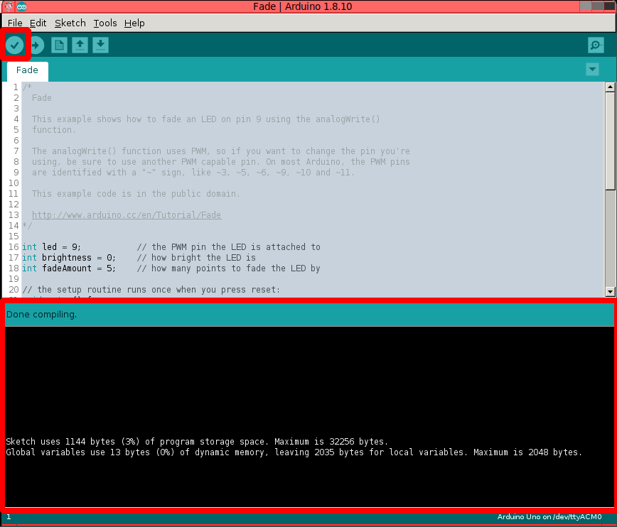
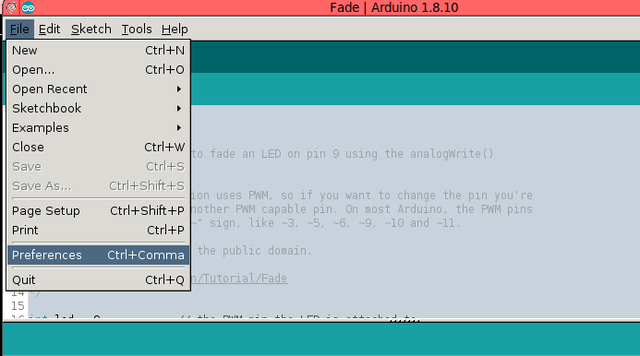
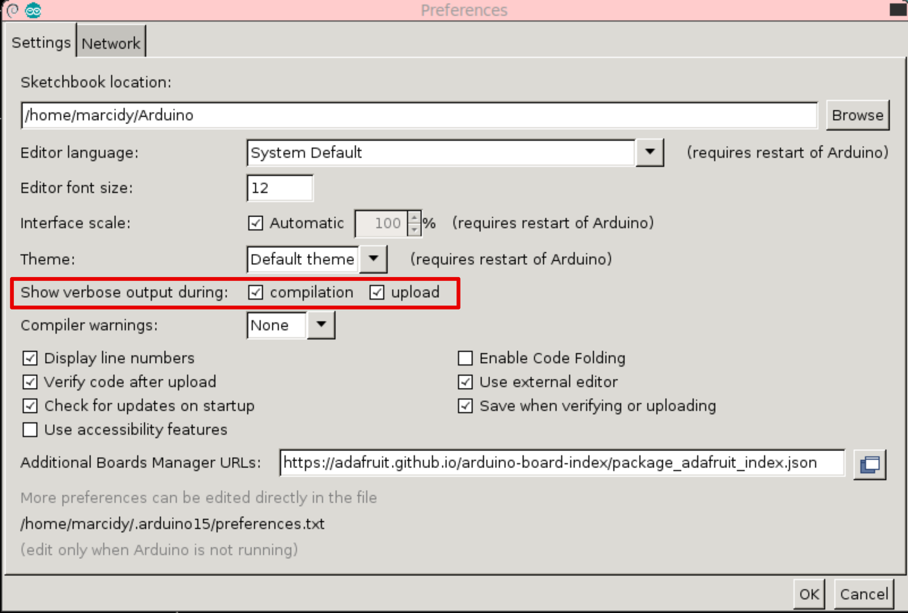

==========
Quickstart
==========
This is an overview with minimal explanation which provides the key details needed to develop for arduino compatible hardware without using the Arduino IDE.  The goal is to point out what the IDE is actually *doing*, why each step is necessary, and how you can do it manaully or with scripts.  For someone who has never compiled their own program, the more detailed explanation may be better, but this will connect the dots for those that just wish to quickly dive in.

I'll try to cross link the sections so a more detailed explanaiton is accessible.

First Compilation
=================

Load up the Arduino IDE, and load the "fade.ino" sketch.  I'm never going to use the work "sketch" again, I'll refer to them as files, sources, etc. Hit the compile (verify) button, and make the output screen big enough to see what's happening.

Not much info given at all!  We will change that now to see what commands the IDE is executing to compile the program.

IDE configuration
=================
The IDE provides all the information we need, but we need to tick a couple boxes so it will output the relevant information.

Open Arduino preferences.

Detailed Compilation
====================
Hit compile again.

.. image:: img/compile-2.png
    :width: 640px
    :alt: Arduino IDE Preferences
    :align: right

Lot's more output!  This is a combination of commands tht were run and output from those commands.  Let's look at my output and take a look.

.. code:: bash

  /home/marcidy/arduino-1.8.10/arduino-builder -dump-prefs -logger=machine -hardware /home/marcidy/arduino-1.8.10/hardware -hardware /home/marcidy/.arduino15/packages -hardware /home/marcidy/Arduino/hardware -tools /home/marcidy/arduino-1.8.10/tools-builder -tools /home/marcidy/arduino-1.8.10/hardware/tools/avr -tools /home/marcidy/.arduino15/packages -built-in-libraries /home/marcidy/arduino-1.8.10/libraries -libraries /home/marcidy/Arduino/libraries -fqbn=arduino:avr:uno -ide-version=10810 -build-path /tmp/arduino_build_709419 -warnings=none -build-cache /tmp/arduino_cache_430568 -prefs=build.warn_data_percentage=75 -prefs=runtime.tools.arduinoOTA.path=/home/marcidy/.arduino15/packages/arduino/tools/arduinoOTA/1.3.0 -prefs=runtime.tools.arduinoOTA-1.3.0.path=/home/marcidy/.arduino15/packages/arduino/tools/arduinoOTA/1.3.0 -prefs=runtime.tools.avr-gcc.path=/home/marcidy/.arduino15/packages/arduino/tools/avr-gcc/7.3.0-atmel3.6.1-arduino5 -prefs=runtime.tools.avr-gcc-7.3.0-atmel3.6.1-arduino5.path=/home/marcidy/.arduino15/packages/arduino/tools/avr-gcc/7.3.0-atmel3.6.1-arduino5 -prefs=runtime.tools.avrdude.path=/home/marcidy/.arduino15/packages/arduino/tools/avrdude/6.3.0-arduino17 -prefs=runtime.tools.avrdude-6.3.0-arduino17.path=/home/marcidy/.arduino15/packages/arduino/tools/avrdude/6.3.0-arduino17 -verbose /home/marcidy/arduino-1.8.10/examples/01.Basics/Fade/Fade.ino
  /home/marcidy/arduino-1.8.10/arduino-builder -compile -logger=machine -hardware /home/marcidy/arduino-1.8.10/hardware -hardware /home/marcidy/.arduino15/packages -hardware /home/marcidy/Arduino/hardware -tools /home/marcidy/arduino-1.8.10/tools-builder -tools /home/marcidy/arduino-1.8.10/hardware/tools/avr -tools /home/marcidy/.arduino15/packages -built-in-libraries /home/marcidy/arduino-1.8.10/libraries -libraries /home/marcidy/Arduino/libraries -fqbn=arduino:avr:uno -ide-version=10810 -build-path /tmp/arduino_build_709419 -warnings=none -build-cache /tmp/arduino_cache_430568 -prefs=build.warn_data_percentage=75 -prefs=runtime.tools.arduinoOTA.path=/home/marcidy/.arduino15/packages/arduino/tools/arduinoOTA/1.3.0 -prefs=runtime.tools.arduinoOTA-1.3.0.path=/home/marcidy/.arduino15/packages/arduino/tools/arduinoOTA/1.3.0 -prefs=runtime.tools.avr-gcc.path=/home/marcidy/.arduino15/packages/arduino/tools/avr-gcc/7.3.0-atmel3.6.1-arduino5 -prefs=runtime.tools.avr-gcc-7.3.0-atmel3.6.1-arduino5.path=/home/marcidy/.arduino15/packages/arduino/tools/avr-gcc/7.3.0-atmel3.6.1-arduino5 -prefs=runtime.tools.avrdude.path=/home/marcidy/.arduino15/packages/arduino/tools/avrdude/6.3.0-arduino17 -prefs=runtime.tools.avrdude-6.3.0-arduino17.path=/home/marcidy/.arduino15/packages/arduino/tools/avrdude/6.3.0-arduino17 -verbose /home/marcidy/arduino-1.8.10/examples/01.Basics/Fade/Fade.ino
  Using board 'uno' from platform in folder: /home/marcidy/.arduino15/packages/arduino/hardware/avr/1.8.2
  Using core 'arduino' from platform in folder: /home/marcidy/.arduino15/packages/arduino/hardware/avr/1.8.2
  Detecting libraries used...
  /home/marcidy/.arduino15/packages/arduino/tools/avr-gcc/7.3.0-atmel3.6.1-arduino5/bin/avr-g++ -c -g -Os -w -std=gnu++11 -fpermissive -fno-exceptions -ffunction-sections -fdata-sections -fno-threadsafe-statics -Wno-error=narrowing -flto -w -x c++ -E -CC -mmcu=atmega328p -DF_CPU=16000000L -DARDUINO=10810 -DARDUINO_AVR_UNO -DARDUINO_ARCH_AVR -I/home/marcidy/.arduino15/packages/arduino/hardware/avr/1.8.2/cores/arduino -I/home/marcidy/.arduino15/packages/arduino/hardware/avr/1.8.2/variants/standard /tmp/arduino_build_709419/sketch/Fade.ino.cpp -o /dev/null
  Generating function prototypes...
  /home/marcidy/.arduino15/packages/arduino/tools/avr-gcc/7.3.0-atmel3.6.1-arduino5/bin/avr-g++ -c -g -Os -w -std=gnu++11 -fpermissive -fno-exceptions -ffunction-sections -fdata-sections -fno-threadsafe-statics -Wno-error=narrowing -flto -w -x c++ -E -CC -mmcu=atmega328p -DF_CPU=16000000L -DARDUINO=10810 -DARDUINO_AVR_UNO -DARDUINO_ARCH_AVR -I/home/marcidy/.arduino15/packages/arduino/hardware/avr/1.8.2/cores/arduino -I/home/marcidy/.arduino15/packages/arduino/hardware/avr/1.8.2/variants/standard /tmp/arduino_build_709419/sketch/Fade.ino.cpp -o /tmp/arduino_build_709419/preproc/ctags_target_for_gcc_minus_e.cpp
  /home/marcidy/arduino-1.8.10/tools-builder/ctags/5.8-arduino11/ctags -u --language-force=c++ -f - --c++-kinds=svpf --fields=KSTtzns --line-directives /tmp/arduino_build_709419/preproc/ctags_target_for_gcc_minus_e.cpp
  Compiling sketch...
  /home/marcidy/.arduino15/packages/arduino/tools/avr-gcc/7.3.0-atmel3.6.1-arduino5/bin/avr-g++ -c -g -Os -w -std=gnu++11 -fpermissive -fno-exceptions -ffunction-sections -fdata-sections -fno-threadsafe-statics -Wno-error=narrowing -MMD -flto -mmcu=atmega328p -DF_CPU=16000000L -DARDUINO=10810 -DARDUINO_AVR_UNO -DARDUINO_ARCH_AVR -I/home/marcidy/.arduino15/packages/arduino/hardware/avr/1.8.2/cores/arduino -I/home/marcidy/.arduino15/packages/arduino/hardware/avr/1.8.2/variants/standard /tmp/arduino_build_709419/sketch/Fade.ino.cpp -o /tmp/arduino_build_709419/sketch/Fade.ino.cpp.o
  Compiling libraries...
  Compiling core...
  Using precompiled core: /tmp/arduino_cache_430568/core/core_arduino_avr_uno_2bd201547ef1722ab59b0c23270fe17e.a
  Linking everything together...
  /home/marcidy/.arduino15/packages/arduino/tools/avr-gcc/7.3.0-atmel3.6.1-arduino5/bin/avr-gcc -w -Os -g -flto -fuse-linker-plugin -Wl,--gc-sections -mmcu=atmega328p -o /tmp/arduino_build_709419/Fade.ino.elf /tmp/arduino_build_709419/sketch/Fade.ino.cpp.o /tmp/arduino_build_709419/../arduino_cache_430568/core/core_arduino_avr_uno_2bd201547ef1722ab59b0c23270fe17e.a -L/tmp/arduino_build_709419 -lm
  /home/marcidy/.arduino15/packages/arduino/tools/avr-gcc/7.3.0-atmel3.6.1-arduino5/bin/avr-objcopy -O ihex -j .eeprom --set-section-flags=.eeprom=alloc,load --no-change-warnings --change-section-lma .eeprom=0 /tmp/arduino_build_709419/Fade.ino.elf /tmp/arduino_build_709419/Fade.ino.eep
  /home/marcidy/.arduino15/packages/arduino/tools/avr-gcc/7.3.0-atmel3.6.1-arduino5/bin/avr-objcopy -O ihex -R .eeprom /tmp/arduino_build_709419/Fade.ino.elf /tmp/arduino_build_709419/Fade.ino.hex
  /home/marcidy/.arduino15/packages/arduino/tools/avr-gcc/7.3.0-atmel3.6.1-arduino5/bin/avr-size -A /tmp/arduino_build_709419/Fade.ino.elf
  Sketch uses 1144 bytes (3%) of program storage space. Maximum is 32256 bytes.
  Global variables use 13 bytes (0%) of dynamic memory, leaving 2035 bytes for local variables. Maximum is 2048 bytes.

.. code:: bash

  /home/marcidy/arduino-1.8.10/arduino-builder -dump-prefs -logger=machine -hardware /home/marcidy/arduino-1.8.10/hardware -hardware /home/marcidy/.arduino15/packages -hardware /home/marcidy/Arduino/hardware -tools /home/marcidy/arduino-1.8.10/tools-builder -tools /home/marcidy/arduino-1.8.10/hardware/tools/avr -tools /home/marcidy/.arduino15/packages -built-in-libraries /home/marcidy/arduino-1.8.10/libraries -libraries /home/marcidy/Arduino/libraries -fqbn=arduino:avr:uno -ide-version=10810 -build-path /tmp/arduino_build_709419 -warnings=none -build-cache /tmp/arduino_cache_430568 -prefs=build.warn_data_percentage=75 -prefs=runtime.tools.arduinoOTA.path=/home/marcidy/.arduino15/packages/arduino/tools/arduinoOTA/1.3.0 -prefs=runtime.tools.arduinoOTA-1.3.0.path=/home/marcidy/.arduino15/packages/arduino/tools/arduinoOTA/1.3.0 -prefs=runtime.tools.avr-gcc.path=/home/marcidy/.arduino15/packages/arduino/tools/avr-gcc/7.3.0-atmel3.6.1-arduino5 -prefs=runtime.tools.avr-gcc-7.3.0-atmel3.6.1-arduino5.path=/home/marcidy/.arduino15/packages/arduino/tools/avr-gcc/7.3.0-atmel3.6.1-arduino5 -prefs=runtime.tools.avrdude.path=/home/marcidy/.arduino15/packages/arduino/tools/avrdude/6.3.0-arduino17 -prefs=runtime.tools.avrdude-6.3.0-arduino17.path=/home/marcidy/.arduino15/packages/arduino/tools/avrdude/6.3.0-arduino17 -verbose /home/marcidy/arduino-1.8.10/examples/01.Basics/Fade/Fade.ino
  /home/marcidy/arduino-1.8.10/arduino-builder -compile -logger=machine -hardware /home/marcidy/arduino-1.8.10/hardware -hardware /home/marcidy/.arduino15/packages -hardware /home/marcidy/Arduino/hardware -tools /home/marcidy/arduino-1.8.10/tools-builder -tools /home/marcidy/arduino-1.8.10/hardware/tools/avr -tools /home/marcidy/.arduino15/packages -built-in-libraries /home/marcidy/arduino-1.8.10/libraries -libraries /home/marcidy/Arduino/libraries -fqbn=arduino:avr:uno -ide-version=10810 -build-path /tmp/arduino_build_709419 -warnings=none -build-cache /tmp/arduino_cache_430568 -prefs=build.warn_data_percentage=75 -prefs=runtime.tools.arduinoOTA.path=/home/marcidy/.arduino15/packages/arduino/tools/arduinoOTA/1.3.0 -prefs=runtime.tools.arduinoOTA-1.3.0.path=/home/marcidy/.arduino15/packages/arduino/tools/arduinoOTA/1.3.0 -prefs=runtime.tools.avr-gcc.path=/home/marcidy/.arduino15/packages/arduino/tools/avr-gcc/7.3.0-atmel3.6.1-arduino5 -prefs=runtime.tools.avr-gcc-7.3.0-atmel3.6.1-arduino5.path=/home/marcidy/.arduino15/packages/arduino/tools/avr-gcc/7.3.0-atmel3.6.1-arduino5 -prefs=runtime.tools.avrdude.path=/home/marcidy/.arduino15/packages/arduino/tools/avrdude/6.3.0-arduino17 -prefs=runtime.tools.avrdude-6.3.0-arduino17.path=/home/marcidy/.arduino15/packages/arduino/tools/avrdude/6.3.0-arduino17 -verbose /home/marcidy/arduino-1.8.10/examples/01.Basics/Fade/Fade.ino
  Using board 'uno' from platform in folder: /home/marcidy/.arduino15/packages/arduino/hardware/avr/1.8.2
  Using core 'arduino' from platform in folder: /home/marcidy/.arduino15/packages/arduino/hardware/avr/1.8.2

I'm on a linux machine so '/home/marcidy/arduino-1.8.10' bits are the path to the arduino builder tool.  This tool is a program that comes with the arduino IDE to collect information about the code you want to compile.  I'm going to skip this tool in this section since the goal of this tutorial is to not use arduino tools, but there's a more in-depth explanation here:

    :ref:`arduino-builder`

I've expanded the next lines to split out all the options passed to avr-g++.

.. code:: bash
    
  Detecting libraries used...
  /home/marcidy/.arduino15/packages/arduino/tools/avr-gcc/7.3.0-atmel3.6.1-arduino5/bin/avr-g++
    -c
    -g
    -Os
    -w
    -std=gnu++11
    -fpermissive
    -fno-exceptions
    -ffunction-sections
    -fdata-sections
    -fno-threadsafe-statics
    -Wno-error=narrowing
    -flto
    -w
    -x c++
    -E
    -CC
    -mmcu=atmega328p
    -DF_CPU=16000000L
    -DARDUINO=10810
    -DARDUINO_AVR_UNO
    -DARDUINO_ARCH_AVR
    -I/home/marcidy/.arduino15/packages/arduino/hardware/avr/1.8.2/cores/arduino
    -I/home/marcidy/.arduino15/packages/arduino/hardware/avr/1.8.2/variants/standard /tmp/arduino_build_709419/sketch/Fade.ino.cpp
    -o /dev/null

Here we see the beginning of the tool-chain for avr.   Quick pause to explain what's happening.  Your computer where you write arduino code is probably windows, Mac, or linux, and most likely runs an Intel or AMD processor. There's nothing fundamentally different from those processors and an avr.  You compile code for them, and you end up with a binary file which they can execture.  
