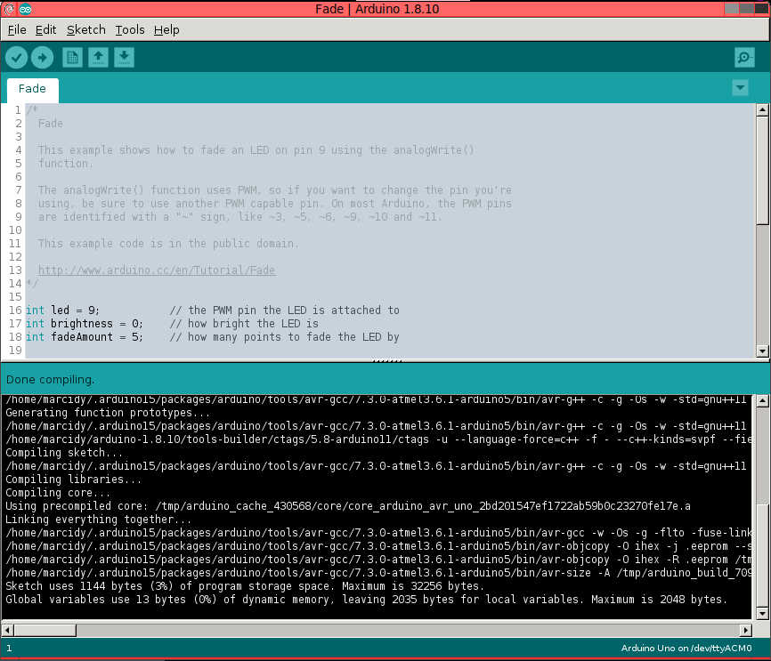

=============================
Starting from the Arduino IDE
=============================
This is an overview with minimal explanation which provides the key details needed to develop, compile, and load firmware without using the Arduino IDE.  The goal is to point out what the IDE is actually *doing*, why each step is necessary, and how you can do it manaully or with scripts.  It will move in steps from using the IDE as is, to executing the same commands on the command line and explaining what the commands are doing and what needs to be changed.

For someone who has never compiled their own program, the more detailed explanation about compilation specifically may also be interesting.

I'll try to cross link the sections so a more detailed explanaiton is accessible.

IDE Compilation
===============
Load up the Arduino IDE, and load the "fade.ino" sketch.  Note that sketches (.ino files) are not exactly valid C or C++, but this will be explained later.

    .. image:: img/compile-1.png
        :height: 480px
        :width: 640px
        :alt: Arduino IDE Preferences

Not much info given at all!  We will change that now to see what commands the IDE is executing to compile the program.

IDE Configuration
-----------------
The IDE provides all the information we need, but we need to tick a couple boxes so it will output the relevant information.

    .. image:: img/arduino-preferences-2.png
        :width: 640px
        :alt: Open Arduino Preferences

Open Arduino preferences.

    .. image:: img/ide-preferences.png
        :width: 640px
        :alt: Arduino IDE Preferences

Tick these boxes to enable more output.

Detailed IDE Compilation
------------------------
Hit compile again.

Lot's more output!  This is a combination of commands tht were run and output from those commands.  Let's look at my output and take a look.

.. code:: bash

  /home/marcidy/arduino-1.8.10/arduino-builder -dump-prefs -logger=machine -hardware /home/marcidy/arduino-1.8.10/hardware -hardware /home/marcidy/.arduino15/packages -hardware /home/marcidy/Arduino/hardware -tools /home/marcidy/arduino-1.8.10/tools-builder -tools /home/marcidy/arduino-1.8.10/hardware/tools/avr -tools /home/marcidy/.arduino15/packages -built-in-libraries /home/marcidy/arduino-1.8.10/libraries -libraries /home/marcidy/Arduino/libraries -fqbn=arduino:avr:uno -ide-version=10810 -build-path /tmp/arduino_build_709419 -warnings=none -build-cache /tmp/arduino_cache_430568 -prefs=build.warn_data_percentage=75 -prefs=runtime.tools.arduinoOTA.path=/home/marcidy/.arduino15/packages/arduino/tools/arduinoOTA/1.3.0 -prefs=runtime.tools.arduinoOTA-1.3.0.path=/home/marcidy/.arduino15/packages/arduino/tools/arduinoOTA/1.3.0 -prefs=runtime.tools.avr-gcc.path=/home/marcidy/.arduino15/packages/arduino/tools/avr-gcc/7.3.0-atmel3.6.1-arduino5 -prefs=runtime.tools.avr-gcc-7.3.0-atmel3.6.1-arduino5.path=/home/marcidy/.arduino15/packages/arduino/tools/avr-gcc/7.3.0-atmel3.6.1-arduino5 -prefs=runtime.tools.avrdude.path=/home/marcidy/.arduino15/packages/arduino/tools/avrdude/6.3.0-arduino17 -prefs=runtime.tools.avrdude-6.3.0-arduino17.path=/home/marcidy/.arduino15/packages/arduino/tools/avrdude/6.3.0-arduino17 -verbose /home/marcidy/arduino-1.8.10/examples/01.Basics/Fade/Fade.ino
  /home/marcidy/arduino-1.8.10/arduino-builder -compile -logger=machine -hardware /home/marcidy/arduino-1.8.10/hardware -hardware /home/marcidy/.arduino15/packages -hardware /home/marcidy/Arduino/hardware -tools /home/marcidy/arduino-1.8.10/tools-builder -tools /home/marcidy/arduino-1.8.10/hardware/tools/avr -tools /home/marcidy/.arduino15/packages -built-in-libraries /home/marcidy/arduino-1.8.10/libraries -libraries /home/marcidy/Arduino/libraries -fqbn=arduino:avr:uno -ide-version=10810 -build-path /tmp/arduino_build_709419 -warnings=none -build-cache /tmp/arduino_cache_430568 -prefs=build.warn_data_percentage=75 -prefs=runtime.tools.arduinoOTA.path=/home/marcidy/.arduino15/packages/arduino/tools/arduinoOTA/1.3.0 -prefs=runtime.tools.arduinoOTA-1.3.0.path=/home/marcidy/.arduino15/packages/arduino/tools/arduinoOTA/1.3.0 -prefs=runtime.tools.avr-gcc.path=/home/marcidy/.arduino15/packages/arduino/tools/avr-gcc/7.3.0-atmel3.6.1-arduino5 -prefs=runtime.tools.avr-gcc-7.3.0-atmel3.6.1-arduino5.path=/home/marcidy/.arduino15/packages/arduino/tools/avr-gcc/7.3.0-atmel3.6.1-arduino5 -prefs=runtime.tools.avrdude.path=/home/marcidy/.arduino15/packages/arduino/tools/avrdude/6.3.0-arduino17 -prefs=runtime.tools.avrdude-6.3.0-arduino17.path=/home/marcidy/.arduino15/packages/arduino/tools/avrdude/6.3.0-arduino17 -verbose /home/marcidy/arduino-1.8.10/examples/01.Basics/Fade/Fade.ino
  Using board 'uno' from platform in folder: /home/marcidy/.arduino15/packages/arduino/hardware/avr/1.8.2
  Using core 'arduino' from platform in folder: /home/marcidy/.arduino15/packages/arduino/hardware/avr/1.8.2
  Detecting libraries used...
  /home/marcidy/.arduino15/packages/arduino/tools/avr-gcc/7.3.0-atmel3.6.1-arduino5/bin/avr-g++ -c -g -Os -w -std=gnu++11 -fpermissive -fno-exceptions -ffunction-sections -fdata-sections -fno-threadsafe-statics -Wno-error=narrowing -flto -w -x C++ -E -CC -mmcu=atmega328p -DF_CPU=16000000L -DARDUINO=10810 -DARDUINO_AVR_UNO -DARDUINO_ARCH_AVR -I/home/marcidy/.arduino15/packages/arduino/hardware/avr/1.8.2/cores/arduino -I/home/marcidy/.arduino15/packages/arduino/hardware/avr/1.8.2/variants/standard /tmp/arduino_build_709419/sketch/Fade.ino.cpp -o /dev/null
  Generating function prototypes...
  /home/marcidy/.arduino15/packages/arduino/tools/avr-gcc/7.3.0-atmel3.6.1-arduino5/bin/avr-g++ -c -g -Os -w -std=gnu++11 -fpermissive -fno-exceptions -ffunction-sections -fdata-sections -fno-threadsafe-statics -Wno-error=narrowing -flto -w -x C++ -E -CC -mmcu=atmega328p -DF_CPU=16000000L -DARDUINO=10810 -DARDUINO_AVR_UNO -DARDUINO_ARCH_AVR -I/home/marcidy/.arduino15/packages/arduino/hardware/avr/1.8.2/cores/arduino -I/home/marcidy/.arduino15/packages/arduino/hardware/avr/1.8.2/variants/standard /tmp/arduino_build_709419/sketch/Fade.ino.cpp -o /tmp/arduino_build_709419/preproc/ctags_target_for_gcc_minus_e.cpp
  /home/marcidy/arduino-1.8.10/tools-builder/ctags/5.8-arduino11/ctags -u --language-force=C++ -f - --C++-kinds=svpf --fields=KSTtzns --line-directives /tmp/arduino_build_709419/preproc/ctags_target_for_gcc_minus_e.cpp
  Compiling sketch...
  /home/marcidy/.arduino15/packages/arduino/tools/avr-gcc/7.3.0-atmel3.6.1-arduino5/bin/avr-g++ -c -g -Os -w -std=gnu++11 -fpermissive -fno-exceptions -ffunction-sections -fdata-sections -fno-threadsafe-statics -Wno-error=narrowing -MMD -flto -mmcu=atmega328p -DF_CPU=16000000L -DARDUINO=10810 -DARDUINO_AVR_UNO -DARDUINO_ARCH_AVR -I/home/marcidy/.arduino15/packages/arduino/hardware/avr/1.8.2/cores/arduino -I/home/marcidy/.arduino15/packages/arduino/hardware/avr/1.8.2/variants/standard /tmp/arduino_build_709419/sketch/Fade.ino.cpp -o /tmp/arduino_build_709419/sketch/Fade.ino.cpp.o
  Compiling libraries...
  Compiling core...
  Using precompiled core: /tmp/arduino_cache_430568/core/core_arduino_avr_uno_2bd201547ef1722ab59b0c23270fe17e.a
  Linking everything together...
  /home/marcidy/.arduino15/packages/arduino/tools/avr-gcc/7.3.0-atmel3.6.1-arduino5/bin/avr-gcc -w -Os -g -flto -fuse-linker-plugin -Wl,--gc-sections -mmcu=atmega328p -o /tmp/arduino_build_709419/Fade.ino.elf /tmp/arduino_build_709419/sketch/Fade.ino.cpp.o /tmp/arduino_build_709419/../arduino_cache_430568/core/core_arduino_avr_uno_2bd201547ef1722ab59b0c23270fe17e.a -L/tmp/arduino_build_709419 -lm
  /home/marcidy/.arduino15/packages/arduino/tools/avr-gcc/7.3.0-atmel3.6.1-arduino5/bin/avr-objcopy -O ihex -j .eeprom --set-section-flags=.eeprom=alloc,load --no-change-warnings --change-section-lma .eeprom=0 /tmp/arduino_build_709419/Fade.ino.elf /tmp/arduino_build_709419/Fade.ino.eep
  /home/marcidy/.arduino15/packages/arduino/tools/avr-gcc/7.3.0-atmel3.6.1-arduino5/bin/avr-objcopy -O ihex -R .eeprom /tmp/arduino_build_709419/Fade.ino.elf /tmp/arduino_build_709419/Fade.ino.hex
  /home/marcidy/.arduino15/packages/arduino/tools/avr-gcc/7.3.0-atmel3.6.1-arduino5/bin/avr-size -A /tmp/arduino_build_709419/Fade.ino.elf
  Sketch uses 1144 bytes (3%) of program storage space. Maximum is 32256 bytes.
  Global variables use 13 bytes (0%) of dynamic memory, leaving 2035 bytes for local variables. Maximum is 2048 bytes.

.. code:: bash

  /home/marcidy/arduino-1.8.10/arduino-builder -dump-prefs -logger=machine -hardware /home/marcidy/arduino-1.8.10/hardware -hardware /home/marcidy/.arduino15/packages -hardware /home/marcidy/Arduino/hardware -tools /home/marcidy/arduino-1.8.10/tools-builder -tools /home/marcidy/arduino-1.8.10/hardware/tools/avr -tools /home/marcidy/.arduino15/packages -built-in-libraries /home/marcidy/arduino-1.8.10/libraries -libraries /home/marcidy/Arduino/libraries -fqbn=arduino:avr:uno -ide-version=10810 -build-path /tmp/arduino_build_709419 -warnings=none -build-cache /tmp/arduino_cache_430568 -prefs=build.warn_data_percentage=75 -prefs=runtime.tools.arduinoOTA.path=/home/marcidy/.arduino15/packages/arduino/tools/arduinoOTA/1.3.0 -prefs=runtime.tools.arduinoOTA-1.3.0.path=/home/marcidy/.arduino15/packages/arduino/tools/arduinoOTA/1.3.0 -prefs=runtime.tools.avr-gcc.path=/home/marcidy/.arduino15/packages/arduino/tools/avr-gcc/7.3.0-atmel3.6.1-arduino5 -prefs=runtime.tools.avr-gcc-7.3.0-atmel3.6.1-arduino5.path=/home/marcidy/.arduino15/packages/arduino/tools/avr-gcc/7.3.0-atmel3.6.1-arduino5 -prefs=runtime.tools.avrdude.path=/home/marcidy/.arduino15/packages/arduino/tools/avrdude/6.3.0-arduino17 -prefs=runtime.tools.avrdude-6.3.0-arduino17.path=/home/marcidy/.arduino15/packages/arduino/tools/avrdude/6.3.0-arduino17 -verbose /home/marcidy/arduino-1.8.10/examples/01.Basics/Fade/Fade.ino
  /home/marcidy/arduino-1.8.10/arduino-builder -compile -logger=machine -hardware /home/marcidy/arduino-1.8.10/hardware -hardware /home/marcidy/.arduino15/packages -hardware /home/marcidy/Arduino/hardware -tools /home/marcidy/arduino-1.8.10/tools-builder -tools /home/marcidy/arduino-1.8.10/hardware/tools/avr -tools /home/marcidy/.arduino15/packages -built-in-libraries /home/marcidy/arduino-1.8.10/libraries -libraries /home/marcidy/Arduino/libraries -fqbn=arduino:avr:uno -ide-version=10810 -build-path /tmp/arduino_build_709419 -warnings=none -build-cache /tmp/arduino_cache_430568 -prefs=build.warn_data_percentage=75 -prefs=runtime.tools.arduinoOTA.path=/home/marcidy/.arduino15/packages/arduino/tools/arduinoOTA/1.3.0 -prefs=runtime.tools.arduinoOTA-1.3.0.path=/home/marcidy/.arduino15/packages/arduino/tools/arduinoOTA/1.3.0 -prefs=runtime.tools.avr-gcc.path=/home/marcidy/.arduino15/packages/arduino/tools/avr-gcc/7.3.0-atmel3.6.1-arduino5 -prefs=runtime.tools.avr-gcc-7.3.0-atmel3.6.1-arduino5.path=/home/marcidy/.arduino15/packages/arduino/tools/avr-gcc/7.3.0-atmel3.6.1-arduino5 -prefs=runtime.tools.avrdude.path=/home/marcidy/.arduino15/packages/arduino/tools/avrdude/6.3.0-arduino17 -prefs=runtime.tools.avrdude-6.3.0-arduino17.path=/home/marcidy/.arduino15/packages/arduino/tools/avrdude/6.3.0-arduino17 -verbose /home/marcidy/arduino-1.8.10/examples/01.Basics/Fade/Fade.ino
  Using board 'uno' from platform in folder: /home/marcidy/.arduino15/packages/arduino/hardware/avr/1.8.2
  Using core 'arduino' from platform in folder: /home/marcidy/.arduino15/packages/arduino/hardware/avr/1.8.2

I'm on a linux machine so `/home/marcidy/arduino-1.8.10` are the path to the arduino builder tool.  This tool is a program that comes with the arduino IDE to collect information about the code you want to compile.  It uses information from things you've set in the IDE (like the board) and libraries installed through the IDE.  

I'm going to skip this tool in this section since the goal of this tutorial is to not use arduino tools, but there's a more in-depth explanation here: :ref:`arduino-builder`

Command Line Compilation
========================
At this stage we have a valid C++ file output from :ref:`arduino-builder` preprocessing the sketch.

I've expanded the next lines to split out all the options passed to avr-g++.

.. code:: bash
    
  Detecting libraries used...
  /home/marcidy/.arduino15/packages/arduino/tools/avr-gcc/7.3.0-atmel3.6.1-arduino5/bin/avr-g++
    -c
    -g
    -Os
    -w
    -std=gnu++11
    -fpermissive
    -fno-exceptions
    -ffunction-sections
    -fdata-sections
    -fno-threadsafe-statics
    -Wno-error=narrowing
    -flto
    -w
    -x C++
    -E
    -CC
    -mmcu=atmega328p
    -DF_CPU=16000000L
    -DARDUINO=10810
    -DARDUINO_AVR_UNO
    -DARDUINO_ARCH_AVR
    -I/home/marcidy/.arduino15/packages/arduino/hardware/avr/1.8.2/cores/arduino
    -I/home/marcidy/.arduino15/packages/arduino/hardware/avr/1.8.2/variants/standard /tmp/arduino_build_709419/sketch/Fade.ino.cpp
    -o /dev/null

Here we see the beginning of the tool-chain for avr.   

Quick pause to explain what's happening.  Your computer where you write arduino code is probably Windows, Mac, or linux, and most likely runs an Intel or AMD processor. There's nothing fundamentally different from those processors and an avr.  You can compile code for them, and you end up with a binary file which they can execture.  This is all explained in detail in :ref:`compilation_primer`.  

However, key to what we are doing, is that we are not compiling for your computer.  We are compiling for a completely difference processor.  This is called `cross compiling`.  Our computer is the host where we are executing commands to compile for the target machine, in this case an Arduino Uno which has an Atmel AVR ATMega328p microcontroller.

Let's look at this command in more depth.

avr-g++
-------
This is where you need to start paying close attention.  You'll need to understand which options passed to this command will change based on the chip you are programming.  Once you use this command, you are outside of the Arduino build environment and need valid C++ (ie not a .ino file) and which arduino specific libraries from Arduino are used.  We'll stick to using the arduino libraries for now, and in a different section look at how to replace these.  See :ref:`arduino_builder_preproc` to see how the sketch gets converted too valid C++ in the build directory.

`avr-g++` is part of `gcc` which is the Gnu C Compilier.  It starts to get compilicated talking about what exactly is `avr-g++` vs `gcc`, far beyond the scope of this document, so don't worry too much about it.  It suffices to say that `avr-g++` is a free, open source compilier for code which needs to compile to a binary that an avr microcontroller can run.  It's not the only compilier, but it being free and open source means it can be included with the Arduino IDE, and likewise you can use it, without paying.  

The compilier will read source files, and convert what is written in those source files into a binary executable. A natural question is "how?", which of course has many layers and is complicated, and discussed in :ref:`compilation_primer`.

However, it is critical to know (not understand just yet) that "compilation" is a multi-step process:

    1. Pre-processing
    2. Compilation
    3. Assembly
    4. Linking

Let's look at the options passed to `avr-g++` and why, and note these steps in order.  Oh look, even though we are compiling, one of the steps to compiling is compiling.  It's more appropriate to think of "compiling a program" as a 4 step process, where one of those steps is "compile the code to assembly".

First, let's quickly look at `avr-g++ --help`:

:: 

    $ avr-g++ --help
      --version                Display compiler version information
      -dumpspecs               Display all of the built in spec strings
      -dumpversion             Display the version of the compiler
      -dumpmachine             Display the compiler's target processor
      -print-search-dirs       Display the directories in the compiler's search path
      -print-libgcc-file-name  Display the name of the compiler's companion library
      -print-file-name=<lib>   Display the full path to library <lib>
      -print-prog-name=<prog>  Display the full path to compiler component <prog>
      -print-multiarch         Display the target's normalized GNU triplet, used as
                               a component in the library path
      -print-multi-directory   Display the root directory for versions of libgcc
      -print-multi-lib         Display the mapping between command line options and
                               multiple library search directories
      -print-multi-os-directory Display the relative path to OS libraries
      -print-sysroot           Display the target libraries directory
      -print-sysroot-headers-suffix Display the sysroot suffix used to find headers
      -Wa,<options>            Pass comma-separated <options> on to the assembler
      -Wp,<options>            Pass comma-separated <options> on to the preprocessor
      -Wl,<options>            Pass comma-separated <options> on to the linker
      -Xassembler <arg>        Pass <arg> on to the assembler
      -Xpreprocessor <arg>     Pass <arg> on to the preprocessor
      -Xlinker <arg>           Pass <arg> on to the linker
      -save-temps              Do not delete intermediate files
      -save-temps=<arg>        Do not delete intermediate files
      -no-canonical-prefixes   Do not canonicalize paths when building relative
                               prefixes to other gcc components
      -pipe                    Use pipes rather than intermediate files
      -time                    Time the execution of each subprocess
      -specs=<file>            Override built-in specs with the contents of <file>
      -std=<standard>          Assume that the input sources are for <standard>
      --sysroot=<directory>    Use <directory> as the root directory for headers
                               and libraries
      -B <directory>           Add <directory> to the compiler's search paths
      -v                       Display the programs invoked by the compiler
      -###                     Like -v but options quoted and commands not executed
      -E                       Preprocess only; do not compile, assemble or link
      -S                       Compile only; do not assemble or link
      -c                       Compile and assemble, but do not link
      -o <file>                Place the output into <file>
      -pie                     Create a position independent executable
      -shared                  Create a shared library
      -x <language>            Specify the language of the following input files
                               Permissible languages include: c C++ assembler none
                               'none' means revert to the default behavior of
                               guessing the language based on the file's extension
    
    Options starting with -g, -f, -m, -O, -W, or --param are automatically
     passed on to the various sub-processes invoked by avr-g++.  In order to pass
     other options on to these processes the -W<letter> options must be used.
    
So we see that some options (paramters) are consumed by `avr-g++` directly while others are passed along to 'various sub-processes invoked by avr-g++'.  This is related to the multi-step process called `compilation`.

The relevent `avr-g++` options invoked by Arduino:

    `-c`
        Compile and assemble, but do not link
    `-std=gnu++11`
        Assume that the input sources are for gnu++11.  This is the standard to which the code is written, and is like a flavor of C++.  As with all things, programming languages evolve over time, and compilers and code must understand the same version or flavor of the language.  
    `-x C++`
        We're using C++, not C or some other language.
    `-E`
        Preprocess only; do not compile, assemble or link.  This seems at odds with `-c`, however when used together it means "First preprocess only, then compile and and assemble only", which is steps 1 through 3 of compilation.
    `-o <filename>`
        Output the results into <filename>.  Here, the /dev/null is a special file on linux which looks like a file, but really just discards the output.  Seems weird, but what's actually happening is that the useful output is produced by sub-processes.

The other options aren't consumed directly by avr-g++ and are passed to the sub-processes that avr-g++ uses.  Let's take a look at some of them.

    `-D`
        These set variables which are used during the execution of the rest of the sub-processes.  Anytime you see a `-D`X=Y`, the X becomes a variable and Y is the value of that variable for the sub-processes.

    `-DF_CPU=16000000L`
        This sets a variable to the frequency of the microcontroller clock on the target board.  The `L` means "long" as in "long integer".
    `-DARDUINO=10810`
        My version of othe arduino IDE again.
    `-DARDUINO_AVR_UNO`
        This is setting the existance of a variable.  You can think of it like a boolean.  If this variable exists, then the sub-processes can do things which are required by the UNO target.
    `-DARDUINO_ARCH_AVR`
        Another boolean-like variable.  Since the AVR architecture is used by more than just the UNO, this varialbe lets sub-processes do things that are AVR specific rather than just UNO specific.
    `-I`
        These options tell the sub-processes where to look for important files, like libraries
    `-I/home/marcidy/.arduino15/packages/arduino/hardware/avr/1.8.2/cores/arduino`
        You should look in this directory on your machine.  You'll note some very interesting files here.  We'll dig into these in other sections on this site.
    `-I/home/marcidy/.arduino15/packages/arduino/hardware/avr/1.8.2/variants/standard`
        Really you should read all files in all directories indicated by these steps are they are clearly important to compiling your code.  These are low-level definitions of variables, macros, and structures used by Arduino libraries.
    `/tmp/arduino_build_709419/sketch/Fade.ino.cpp`
       This file is in the build directory for your project, created by `arduino-builder`, and a ".cpp" extension has been added to the ".ino".  Part of what `arduino-builder` does is rewrite your file so it's actually valid C++.  Sketches themselves are not a complete program, nor strictly valid C++, but make up part of a larger program which gets compiled.  We'll see that as we move along.  When you write code outside the ecosystem, it will have to be valid C++, so it's important to see where and how this step occurs between "sketch" and code.  See :ref:`arduino_builder_preproc` for some on this.
